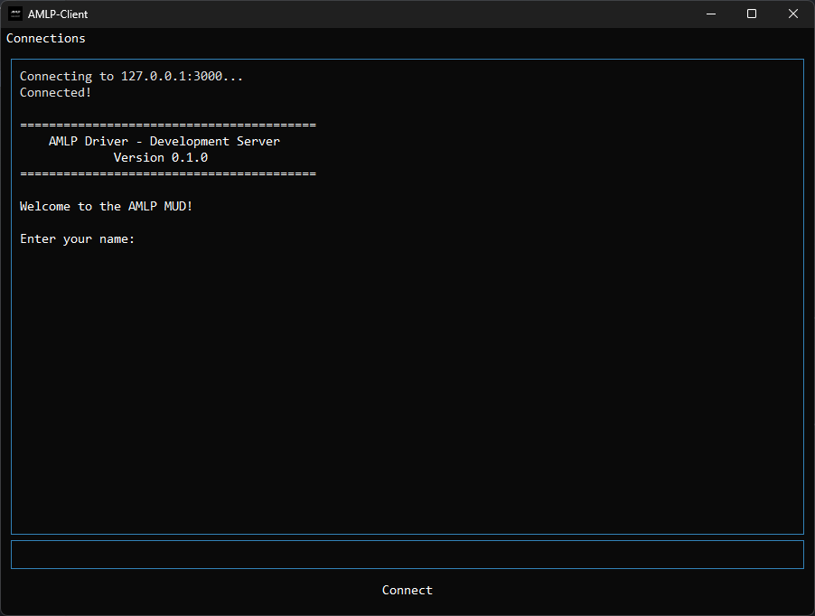
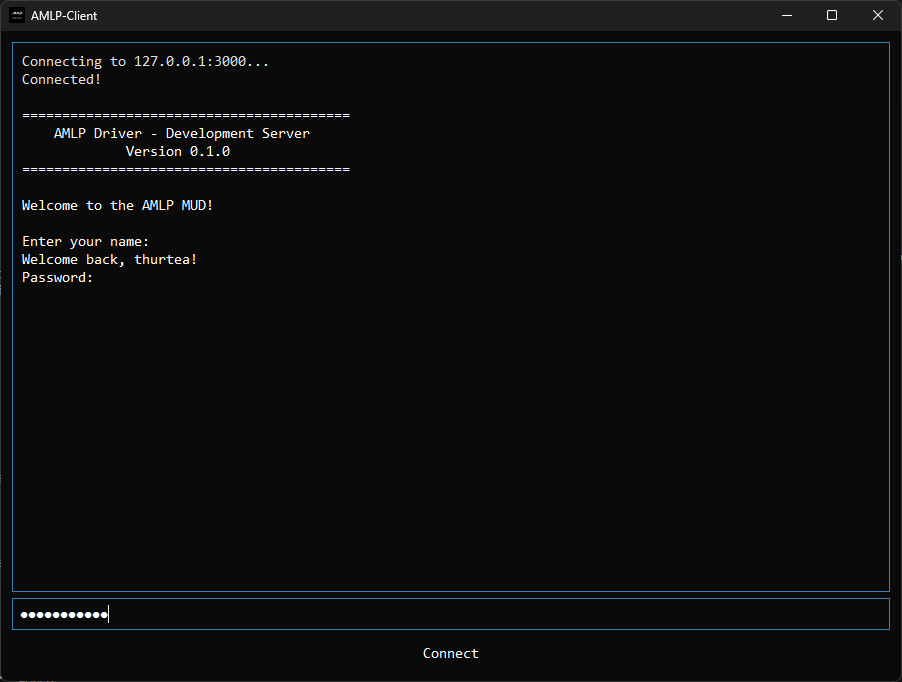
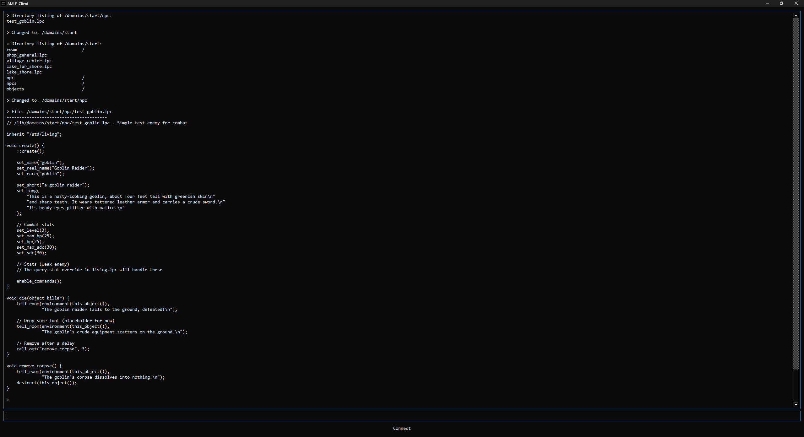
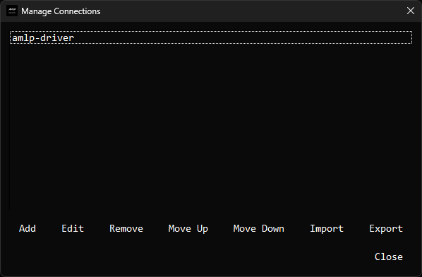
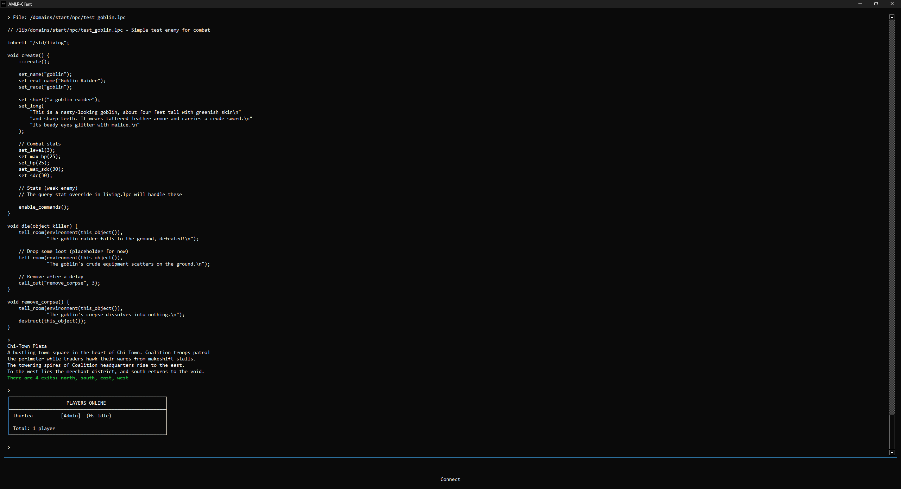

# AMLP-Client

A lightweight, cross-platform MUD (Multi-User Dungeon) client built with Qt6, designed for AetherMUD.

## Features

- ANSI color support (16 colors)
- Password masking
- Dark theme optimized for long gaming sessions
- Fast connection to any telnet-based MUD server
- Cross-platform (Windows, Linux, macOS)

## Screenshots

Additional icons used in UI:

Additional icons used in UI:








## Building from Source

### Prerequisites

- CMake 3.16+
- Qt6 (Core, Widgets, Network)
- vcpkg (recommended for Windows)
- Visual Studio 2022 (Windows) or GCC/Clang (Linux/macOS)

### Windows Build Instructions

1. **Install vcpkg and Qt6:**
```powershell
# Install Qt6 via vcpkg
D:\Tools\vcpkg\vcpkg.exe install qt6-base:x64-windows qt6-network:x64-windows
```

Clone and build:
```powershell
git clone https://github.com/yourusername/amlp-client.git
cd amlp-client
mkdir build
cd build

cmake -G "Visual Studio 17 2022" -A x64 .. -DCMAKE_TOOLCHAIN_FILE=D:/Tools/vcpkg/scripts/buildsystems/vcpkg.cmake -DCMAKE_PREFIX_PATH="D:/Tools/vcpkg/installed/x64-windows"

cmake --build . --config Release
```

Copy Qt runtime files:
```powershell
# From project root
$dest = 'build\Release\platforms'
New-Item -ItemType Directory -Force -Path $dest
Copy-Item 'D:\Tools\vcpkg\installed\x64-windows\Qt6\plugins\platforms\qwindows.dll' -Destination $dest -Force
Copy-Item 'D:\Tools\vcpkg\installed\x64-windows\bin\Qt6Core.dll' -Destination 'build\Release' -Force
Copy-Item 'D:\Tools\vcpkg\installed\x64-windows\bin\Qt6Widgets.dll' -Destination 'build\Release' -Force
Copy-Item 'D:\Tools\vcpkg\installed\x64-windows\bin\Qt6Network.dll' -Destination 'build\Release' -Force
```

Run:
```powershell
.\build\Release\amlp_client.exe
```

### Linux Build Instructions
```bash
# Install Qt6
sudo apt install qt6-base-dev qt6-network-dev cmake build-essential

# Build
git clone https://github.com/yourusername/amlp-client.git
cd amlp-client
mkdir build && cd build
cmake .. -DCMAKE_BUILD_TYPE=Release
cmake --build .

# Run
./amlp_client
```

## Usage
Launch AMLP-Client
Click "Connect" button
Enter server IP and port (default: 127.0.0.1:3000)
Type commands in the input field and press Enter
Password fields are automatically masked

## Connecting to AetherMUD
Official Server: aethermud.com:4000
Local Development: 127.0.0.1:3000

## Project Structure
```
amlp-client/
├── main.cpp          # Main application code
├── CMakeLists.txt    # Build configuration
├── app.rc            # Windows resources (icon)
├── mudclient-icons/  # Application icons
└── README.md         # This file
```

## License
MIT License - See LICENSE file for details

## Contributing
Pull requests welcome! For major changes, please open an issue first.

## Support
Issues: https://github.com/yourusername/amlp-client/issues
AetherMUD: https://aethermud.com

## Roadmap
- Trigger system
- Alias support
- Scrollback buffer
- Session logging
- Split-screen mode
- Lua scripting support
# amlp-client
